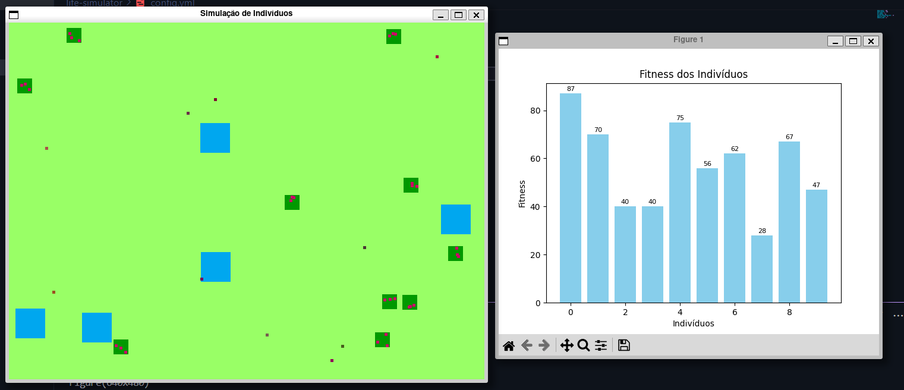

# Life Simulator

Generate random world  to evolve the population.  

# Individual Inputs  
- x Self Location  
- y Self Location  
- x Nearest Food  
- y Nearest Food  
- x Nearest Water  
- y Nearest Water  

# Individual Decisions  
- Reproduce - 0, 1  
- Direction - NORTH, SOUTH, EAST, WEST  
- Kill - 0, 1  

# Individual Stats  
- Age  
- Food  
- Water  

# Individual Genomes  
- Speed  
- Food Capacity  
- Water Capacity  
- Move Cost (Water + Food)  
- Eyes Range  

# Fitness  
Based on (food + water) * inversed age

# Execution

``` bash
pip install -r requirements.txt
```

``` bash
python main.py
```

